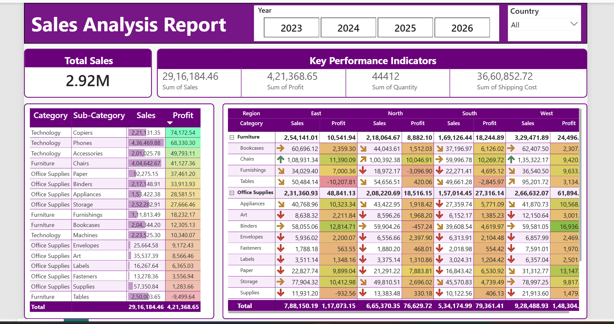

# 📊 Sales Analysis Report — Excel Dashboard

An interactive Excel dashboard built to analyze sales performance across regions, categories, and sub-categories using **Conditional Formatting**, **Tables**, **Matrix** and **Slicers**.

---

## 🖼️ Dashboard Preview



---

## 📌 Overview

This dashboard provides a comprehensive view of sales data from **2023 to 2026**, enabling quick insights into revenue, profitability, and shipping costs across multiple regions — East, North, South, and West.categories, and sub-categories using **Conditional Formatting**, **Tables**, **Matrix** and **Slicers**.

---

## ✨ Features

### 🔢 Key Performance Indicators (KPIs)
- **Total Sales** — 2.92M (aggregate view)
- **Sum of Sales** — 29,16,184.46
- **Sum of Profit** — 4,21,368.65
- **Sum of Quantity** — 44,412
- **Sum of Shipping Cost** — 36,60,852.72

### 🎨 Conditional Formatting
- **Color-coded Profit cells** — Green highlights top-performing sub-categories; Red flags loss-making ones (e.g., Tables at -9,499.64)
- **Arrow Icons (↑ ↓ →)** — Direction indicators on every row show whether sales/profit trend is up, down, or flat compared to benchmark
- **Data Bars on Sales column** — Visual bar length proportional to sales value for quick comparison
- **Gradient color scales** — Applied to profit columns across regions for instant heatmap-style analysis

### 📋 Category & Sub-Category Breakdown (Left Panel)
Ranked table showing Sales and Profit for all sub-categories:
- Technology: Copiers, Phones, Accessories, Machines
- Furniture: Chairs, Bookcases, Furnishings, Tables
- Office Supplies: Paper, Binders, Appliances, Storage, Envelopes, Art, Labels, Fasteners, Supplies

### 🗺️ Region-wise Matrix (Right Panel)
Cross-tabulation of Category × Sub-Category across 4 regions:
| Region | Sales | Profit |
|--------|-------|--------|
| East | 7,88,150.19 | 1,17,073.15 |
| North | 6,65,370.35 | 76,629.72 |
| South | 5,34,174.99 | 79,361.41 |
| West | 9,28,488.93 | 1,48,304+ |

### 🔍 Interactive Filters
- **Year Slicer** — Filter by 2023, 2024, 2025, 2026
- **Country Dropdown** — Filter data by country (default: All)

---

## 🛠️ Tools & Techniques Used

| Tool / Feature | Purpose |
|---|---|
| Microsoft Excel | Primary tool |
| Pivot Tables | Data aggregation by category & region |
| Conditional Formatting | Color scales, icon sets, data bars |
| Slicers | Year and Country filtering |
| Named Ranges | Clean formula references |
| Custom Number Formatting | M/K abbreviations in KPI cards |

---

## 📁 File Structure

```
📦 Sales-Analysis-Dashboard
 ┣ 📊 Sales_Analysis_Report.xlsx    # Main Excel dashboard file
 ┣ 📸 Sales_Analysis_Report.png     # Dashboard screenshot
 ┗ 📄 README.md                     # Project documentation
```

---

## 🚀 How to Use

1. **Download** the `Sales_Analysis_Report.xlsx` file
2. **Open** in Microsoft Excel (2016 or later recommended)
3. Use the **Year buttons** at the top to filter by year
4. Use the **Country dropdown** to filter by specific country
5. Hover over color-coded cells to read exact values
6. Scroll right in the region table to see more regions

---

## 💡 Key Insights from the Data

- 📈 **Technology — Copiers** is the most profitable sub-category overall
- 📉 **Furniture — Tables** shows negative profit (-9,499.64), indicating a loss-making segment
- 🌍 **West region** leads in both Sales and Profit
- 🏢 **Office Supplies — Storage** is a strong performer across all regions

---

## 🙋 About me

A Vinitha Sree
- 💼 [LinkedIn Profile](https://www.linkedin.com/in/vinithasree/)
- 📧 vinithasree04@gmail.com


